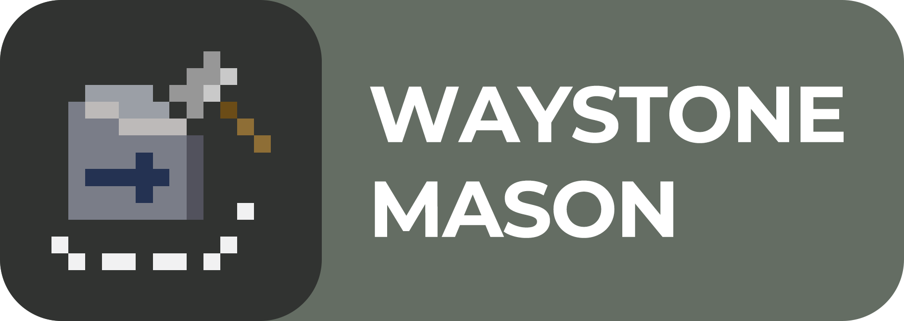

<p align="center"></p>

[English documentation](README.md)

[**Waystone Mason**](#семантика-названия) — это библиотека для 2D поиска пути по навмешу.

Чем этот проект отличается от готовых решений?
 - Навмеши не являются синглтонами, что дает возможность давать агентам персональные навмеши. 
 - Есть возможность ручного управления процессом обновления состояния препятствия на навмеше, 
что, например, можно использовать для эффекта памяти у агентов.

   

# Краткое описание работы

### Работа навмешей
Свободная для перемещения область размечена треугольниками — там, где нет никакого треугольника, ходить нельзя. 
Треугольники хранятся через spatial index, другими словами группируются в чанки — в квадратные области фиксированного размера, расположенные по сетке.

Соответственно, автоматически чанк создастся только в случае, если в его пределах появится какое-либо препятствие,
поэтому желательно самостоятельно прегенерировать чанки в необходимых местах либо вручную, через метод `NavMesh.GetOrCreateChunk()`, либо задать область с прегенерацией
через [WMObstaclesHolder.PregeneratedEmptyChunksRegion](#WMObstaclesHolder)

### Работа поиска пути
Треугольники можно представить в виде графа, где вершины — это сами треугольники, а рёбра — наличие общей стороны между двумя треугольниками.
Для поиска пути в таком графе используется алгоритм A*, который находит последовательность треугольников, через которые нужно пройти, чтобы достичь цели.
Затем полученная последовательность обрабатывается с помощью алгоритма String Pulling, который формирует финальный маршрут агента.


# Документация

**Waystone Mason** предусматривает два уровня взаимодействия с системой навигации: 
[ручной](#ручное-управление) и [автоматический](#автоматическое—управление).

## Автоматическое управление

В проекте предусмотрено несколько компонентов для базовой инфраструктуры поиска пути.

### WMNavMeshHolder
При запуске игры создаст экземпляр NavMesh с заданным радиусом агента, далее он периодически будет вызывать его перестройку.

Имеет событие `OnBeforeRebuild`, вызываемое перед каждой перестройкой. Пригодится при ручном сканировании препятствий. 

### WMAgent
Имеет метод для установки цели перемещения — `SetGoal()`. 
При его вызове агент рассчитает путь до цели по NavMesh указанного `WMNavMeshHolder` и начнет следовать по нему.

### WMDynamicObstacle
Исходя из указанного коллайдера строит контур препятствия. Сам по себе более ничего не делает, 
нужно вызывать метод `Affect()`, чтобы актуализировать его состояние на указанном навмеше.

### WMObstaclesHolder
Контейнер для всех препятствий на сцене, позволяет эффективно получать все препятствия в радиусе.

Поле `PregeneratedEmptyChunksRegion` обозначает прямоугольную область, для которой в начале игры будут созданы пустые чанки.

**Его наличие необходимо для работы остальных компонентов.**

### WMNavMeshObstaclesScanner
Исходя из указанных условий ищет подходящие `WMDynamicObstacle` и вызывает их метод `Affect()` для указанного `WMNavMeshHolder`.

## Ручное управление

Если возможностей встроенных компонентов не хватает и нужен более тонкий контроль над содержанием навмешей, 
то стоит спуститься на уровень ниже, на уровень ядра библиотеки.

Для создания навмеша необходимо указать лишь радиус коллайдера агента. Учтите, что **радиус нельзя изменять после создания объекта**.
```cs
var agentRadius = 0.25f;
var navMesh = new NavMesh(agentRadius);
```

Для ручного добавления препятствия нужно передать в метод его контур объектом типа `Clipper.PathD`. 
Чтобы отобразить изменения добавленного контура, нужно удалить старый и добавить актуальный. 
```cs
var triangleObstacle = new PathsD { new PathD { new PointD(0, 0), new PointD(1, 0), new PointD(1, 1) } };
navMesh.AddObstacle(triangleObstacle);
navMesh.Rebuild();

// Later
navMesh.RemoveObstacle(triangleObstacle);
var translated = Clipper.TranslatePaths(triangleObstacle, 1, 0);
navMesh.AddObstacle(translated);

navMesh.Rebuild();
```

Если препятствие по задумке не должно никак изменяться и пропадать, то можно добавить его на навмеш перманентно. 
Перманентные препятствия нельзя убрать с навмеша, но обрабатывать такие препятствия дешевле.
```cs
navMesh.AddObstacle(triangleObstacle, true);
```

Перестройка NavMesh — **дорогая операция**, поэтому при добавлении или удалении препятствия NavMesh **не перестраивается автоматически**, 
для этого нужно вызывать метод `NavMesh.Rebuild()`.

Для получения пути нужно лишь указать точки начала и конца маршрута. Метод вернет `false`, если простроить маршрут невозможно
```cs
var start = new Vector2(0, 0);
var goal = new Vector2(2, 2);
if (!navMesh.TryComputePath(start, goal, out var path)) Debug.Log("Agent can't reach the goal!");
```


# Семантика названия
Waystone: Итоговый путь, по которому нужно следовать агенту, — это набор углов, то есть мест где нужно повернуть и продолжить 
движение по прямой, поэтому их и можно назвать путеводными камнями

Mason: Сама библиотека является *каменщиком*, ведь именно он создает путеводные камни для агентов