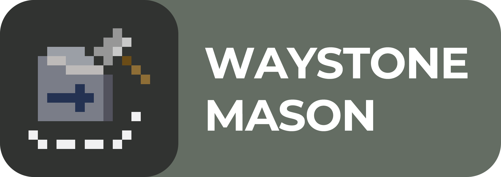

<p align="center"></p>

[Документация на русском](README-RU.md)

[**Waystone Mason**](#semantics-of-the-name) is a library for 2D pathfinding using NavMeshes.

What makes this project different from existing solutions?
- Navmeshes are not singletons, allowing agents to have personal NavMeshes.
- You can manually control how obstacle updates affect the NavMesh,
  which can be used, for example, to simulate agents’ memory.

---

# Brief Description of How It Works

### NavMesh Operation
The walkable area is marked with triangles — if there is no triangle, the area is not walkable.  
Triangles are stored via a spatial index — in other words, grouped into **chunks**, which are square areas of fixed size arranged in a grid.

Accordingly, a chunk will only be created automatically if an obstacle appears within its bounds.  
Therefore, it is recommended to pre-generate chunks in required areas either manually via `NavMesh.GetOrCreateChunk(Vector2Int)`,  
or define a region for pre-generation via [WMObstaclesHolder.PregeneratedEmptyChunksRegion](#WMObstaclesHolder)

### Pathfinding Operation
Triangles can be represented as a graph, where each node corresponds to a triangle, and an edge exists between two nodes if the corresponding triangles share a common edge.
To find a path through this graph, the A* algorithm is used to compute a sequence of triangles that leads to the target.
This sequence is then processed by the String Pulling algorithm, which produces the final path for the agent.

# Documentation

**Waystone Mason** offers two levels of interaction with the navigation system:  
[manual](#manual-control) and [automatic](#automatic-control).

## Automatic Control

The project provides several components to set up basic pathfinding infrastructure.

### WMNavMeshHolder
On game start, it creates a NavMesh instance with a given agent radius and periodically rebuilds it.

For isometric games, set `IsIsometric` to `true` and specify the appropriate vertical coordinate scale in the `IsometryYScale` field, 
otherwise distances will be calculated incorrectly.

It has the following events:
- `OnBeforeRebuild` – called before each rebuild.
- `OnAfterRebuildWithAnyChanges` – called after the rebuild if at least one chunk was changed.

### WMAgent
Has a method for setting a movement target – `SetGoal(Vector2)`.  
When called, the agent computes a path to the goal using the NavMesh from the specified `WMNavMeshHolder` and starts following it.

### WMNavMeshObstacle
Same as `WMNavMeshDynamicObstacle`, but added to the NavMesh permanently — once and forever.  
This component should be used for fully static obstacles.

### WMDynamicObstacle
Generates an obstacle contour based on the specified collider.  
By itself, it does not affect the NavMesh — to do so, you must call its `Affect(NavMesh)` method to update the obstacle state on the given NavMesh.

### WMObstaclesHolder
Container for all obstacles in the scene. Allows efficiently querying obstacles within a radius.

The field `PregeneratedEmptyChunksRegion` defines a rectangular region where empty chunks will be pre-created at game start.

**This component is required for the others to work.**

### WMNavMeshObstaclesScanner
Based on the specified conditions, it searches for suitable `WMDynamicObstacle` instances and calls their `Affect(NavMesh)` method for the given `WMNavMeshHolder`.

For obstacles that have changed state (e.g. moved or had their contour shape modified) since their last update, two contours formally exist:
- the previous contour — the one that existed at the time of the last `Affect()` call;
- and the current contour — the one matching the obstacle’s current shape or position.

If only the previous contour falls within the scan radius, the scanner assumes the obstacle has either disappeared or moved,  
and removes it from the NavMesh. If the current contour is within range, the scanner adds it to the NavMesh and also removes the outdated one.

To create a custom scanner, you need to inherit from the `ObstaclesScannerBase` class and implement three methods:
1. `GetSeenObstacles()` – a method for retrieving the obstacles visible at the time of the call.
2. `IsVisible()` – a method for checking whether contours are visible.
3. `GetChunkPregenerationRect()` – a method for obtaining a rectangle that covers the entire visible area of the scanner.

## Manual Control

If the built-in components are not enough, and you need finer control over NavMesh content,  
drop down to the core library level.

To create a NavMesh, you only need to specify the agent collider radius.  
Note that **the radius cannot be changed after the object is created**.
In addition to the radius, you can optionally specify a transformation matrix for converting screen coordinates to world coordinates.
Currently, only distance calculations depend on this.
```cs
var agentRadius = 0.25f;
var navMesh = new NavMesh(agentRadius);
```

To manually add an obstacle, pass its contour as a `Clipper.PathD` object.  
To reflect the change, you must remove the old one and add the updated one.

```cs
var triangleObstacle = new PathD { new PointD(0, 0), new PointD(1, 0), new PointD(1, 1) };
navMesh.AddObstacle(triangleObstacle);
navMesh.Rebuild();

// Later
navMesh.RemoveObstacle(triangleObstacle);
var translated = Clipper.TranslatePaths(triangleObstacle, 1, 0);
navMesh.AddObstacle(translated);

navMesh.Rebuild();
```

If the obstacle is not supposed to change or disappear during game, it can be added to the NavMesh permanently.
During NavMesh rebuilding, permanent obstacles are processed more cheaply than dynamic ones,
but they cannot be removed from the NavMesh later.

```cs
navMesh.AddObstacle(triangleObstacle, true);
```

NavMesh rebuilding is a **costly operation**, so adding/removing obstacles **does not rebuild automatically**.  
You must explicitly call `NavMesh.Rebuild()`.

To get a path, simply provide the start and goal points. The method returns `false` if the path cannot be computed.

```cs
var start = new Vector2(0, 0);
var goal = new Vector2(2, 2);
if (!navMesh.TryComputePath(start, goal, out var path)) Debug.Log("Agent can't reach the goal!");
```

# Semantics of the Name
**Waystone**: The final path for the agent is a series of corners — places to turn and then move straight —  
so they can be called waystones (guiding stones).

**Mason**: The library itself is the *mason*, because it builds the waystones for agents to follow.
